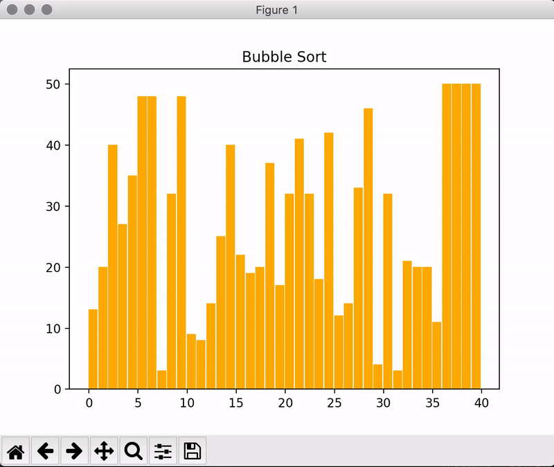
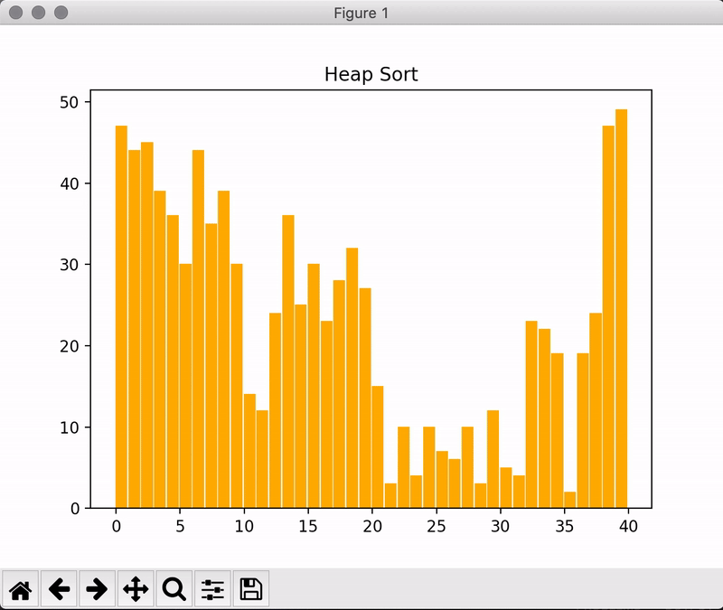
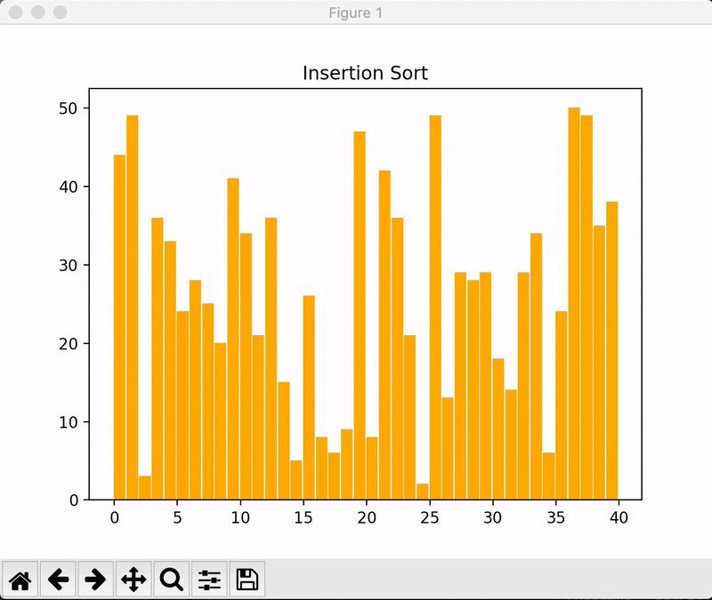
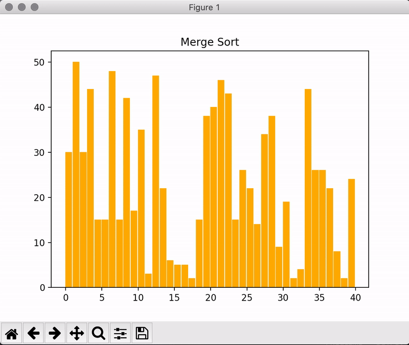

## Sorting visualiser with Python
With 7 different sorting algorithms to visualise!

#### Demo
  <br>
 
#### To run
1. Clone my project. ```git clone https://github.com/alxojy/sorting-visualiser.git```
2. Make sure that you have matplotlib installed. If not, refer to dependencies.
3. Run ```visualiser.py```
4. Choose the sorting algorithm to visualise! 

#### Dependencies
```matplotlib```

To install matplotlib, run ```pip3 install matplotlib``` in your terminal if you're using ```python 3.x```. 

#### Sorting algorithms
Refer to [sorting algorithms](https://github.com/alxojy/sorting-algorithms) I coded prior to this and their time complexities. 
